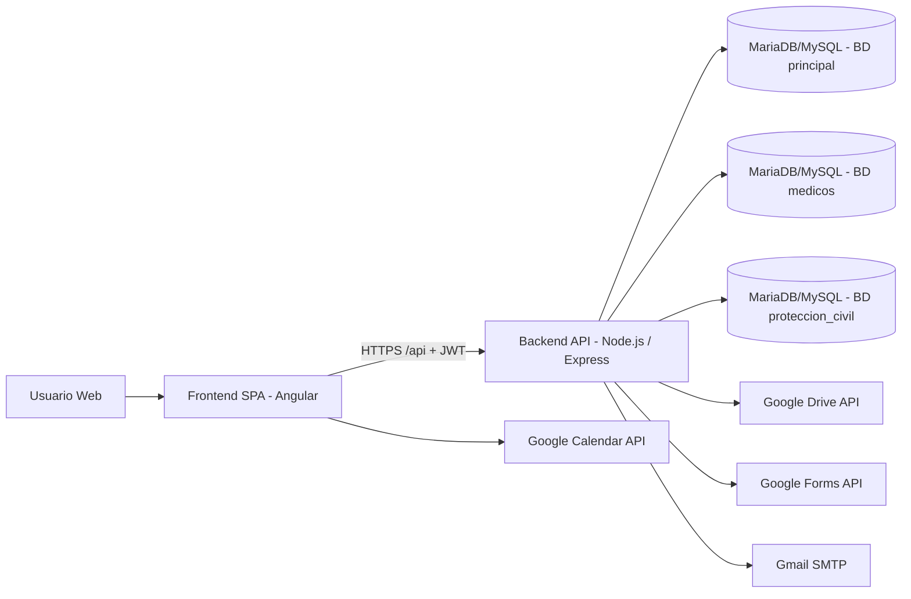
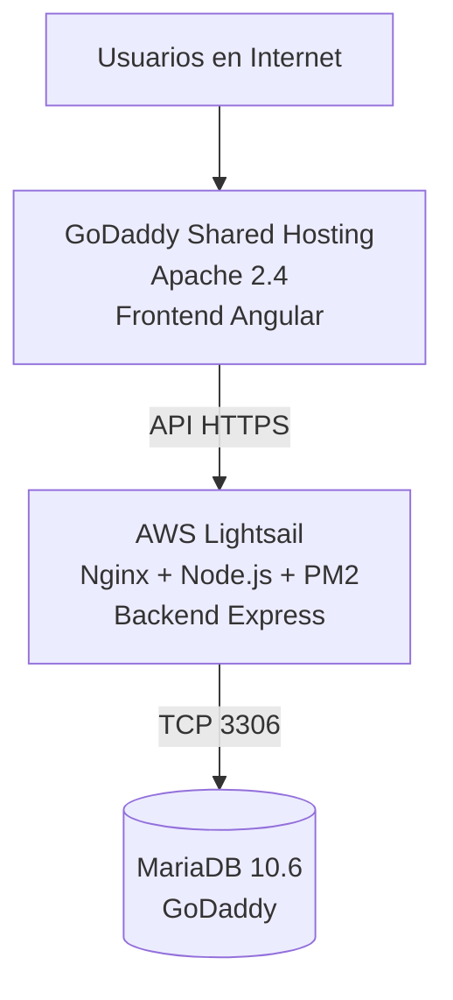

# Arquitectura y Tecnologías — Proyecto BIZNAGA R&T

> Documento base para construir diagrama de arquitectura (lógico y de despliegue).
> Fecha de actualización: 2026-09-02
>
> Guía de exposición (qué es cada tecnología): [COMPONENTES-PARA-EXPOSICION.md](./COMPONENTES-PARA-EXPOSICION.md)

---

## 1) Resumen ejecutivo

El sistema usa una arquitectura **web de 3 capas**:

1. **Frontend SPA** en Angular (cliente web).
2. **Backend API REST** en Node.js + Express (lógica de negocio).
3. **Persistencia** en MariaDB/MySQL (múltiples bases de datos).

Además, integra servicios externos (Google Drive, Google Forms, Google Calendar y Gmail SMTP).

---

## 2) Arquitectura lógica (alto nivel)

---

## 3) Arquitectura de despliegue (producción)

- Frontend: `https://sistema.biznaga.com.mx`
- API: `https://api.sistema.biznaga.com.mx/api`
- Tailscale / Raspberry Pi: arquitectura anterior (ya no aplica en producción).

---

## 4) Tecnologías por capa

### 4.1 Frontend

- **Framework:** Angular 14
- **Lenguaje:** TypeScript
- **UI/Estilos:** SCSS, Bootstrap 4.6, Angular Material, ng-bootstrap
- **Gráficas/UI extra:** ApexCharts, Chart.js, ngx-toastr, sweetalert2
- **Generación de documentos en cliente:** jsPDF, html2canvas, pptxgenjs, xlsx, qrcode
- **Arquitectura interna:** módulos, componentes, guards, interceptores y servicios
- **Autenticación cliente:** token JWT almacenado en sessionStorage

### 4.2 Backend

- **Runtime:** Node.js (producción documentada en Node 20)
- **Framework HTTP:** Express 5
- **Lenguaje/módulos:** JavaScript CommonJS
- **Seguridad/autenticación:** jsonwebtoken (JWT), bcryptjs, express-rate-limit, CORS
- **Carga de archivos:** multer (memoria y disco)
- **Acceso a datos:** mysql2/promise (pool de conexiones)
- **Servicios auxiliares:** generación de ZIP/Excel/PDF, envío de correos

### 4.3 Base de datos

- **Motor:** MariaDB/MySQL
- **Estrategia:** múltiples bases separadas por dominio funcional:
  - BD principal del sistema de capacitaciones
  - BD de expedientes médicos
  - BD de protección civil

---

## 5) Integraciones externas

### 5.1 Google Drive (backend)

- Almacenamiento y gestión de carpetas/archivos de evidencias y documentos del curso.
- Autenticación principalmente vía OAuth2 (refresh token), con fallback de service account.

### 5.2 Google Forms (backend)

- Creación/actualización/clonado de encuestas por curso y curso programado.

### 5.3 Google Calendar (frontend)

- Integración desde cliente con Google API para eventos de calendario.

### 5.4 Correo electrónico (backend)

- Envío de notificaciones por SMTP (Nodemailer con Gmail).

---

## 6) Patrón arquitectónico observado

- **Estilo principal:** Monolito modular (frontend SPA + backend API monolítico).
- **Comunicación:** REST sobre HTTPS con JSON.
- **Control de acceso:** JWT + roles/permisos en backend y guards en frontend.
- **Escalabilidad actual:** vertical (un backend principal) con separación de responsabilidades por servicios.

---

## 7) Nodos recomendados para tu diagrama

Para un diagrama claro (C4 nivel contenedores), usa estos bloques:

1. Usuario
2. Frontend Angular (GoDaddy)
3. API Node/Express (AWS Lightsail + Nginx + PM2)
4. MariaDB principal
5. MariaDB médicos
6. MariaDB protección civil
7. Google Drive API
8. Google Forms API
9. Google Calendar API
10. Gmail SMTP

Conecta:

- Usuario -> Frontend
- Frontend -> API
- API -> BDs
- API -> Drive/Forms/Gmail
- Frontend -> Calendar

---

## 8) Fuentes usadas para este documento

- `package.json` (raíz)
- `backend/package.json`
- `backend/server.js`
- `backend/driveService.js`
- `backend/googleFormsService.js`
- `backend/emailService.js`
- `src/environments/environment*.ts`
- `src/app/services/google-calendar.service.ts`
- `INFRAESTRUCTURA-PRODUCCION.md`
